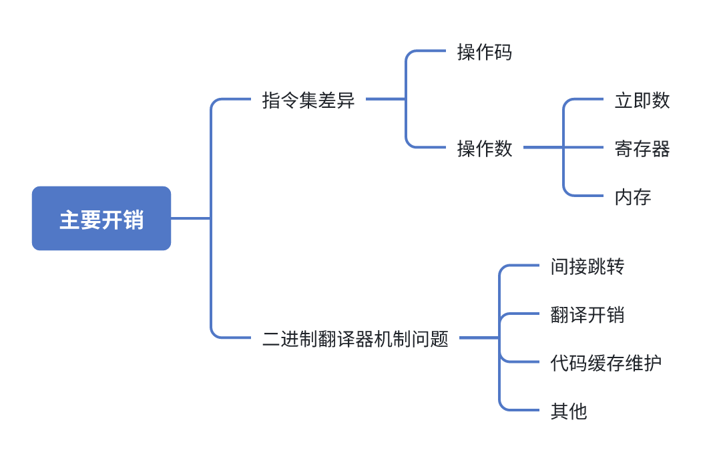
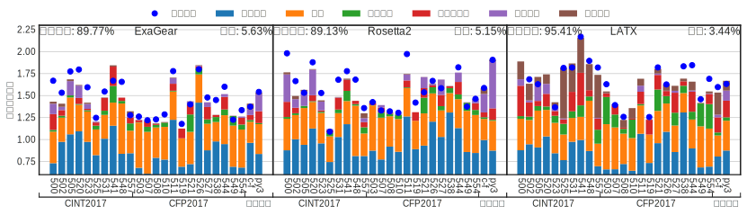

<!-- # 简介 {data-stack-name="简介"} -->
# 引言 {data-stack-name="引言"}

* 背景
* 动机
* 概览

## 国产处理器生态碎片化问题

::: {style="font-size: 0.8em;"}
| 指令集 | 代表公司 | 优势 | 不足 |
| :---: | :---: | :---: | :---: |
| x86 | 兆芯，海光 | 兼容Windows | 授权问题 |
| ARM | 华为，飞腾 | 兼容安卓 | 授权问题 |
| LoongArch | 龙芯 | 自主可控 | 生态不足 |
| RISC-V | 开芯院，阿里 | 开源开放 | 生态不足 |
:::

## 二进制翻译器概述

<!-- 

 -->

::: {style="font-size: 0.6em;"}
| 分类 | 说明 | 优势 | 不足 |
| :---: | :---: | :---: | :---: |
| 静态 | 提前翻译 | 深入的代码分析和优化 | 使用场景受限 |
| 动态 | 运行时翻译和优化 | 能处理动态生成代码 | 额外的运行时开销 |
| 用户态 | 只翻译用户态指令 | 实现简单，性能较高 | 支持应用有限 |
| 系统态 | 模拟整个系统 | 能直接跨架构运行操作系统 | 性能较低 |
| 解释型 | 逐条指令解释执行 | 方便调试模拟等 | 性能很低 |
| 翻译型 | 以基本块为单位翻译执行 | 性能较高 | 设计更加复杂 |
| 软件 | 纯软件实现 | 灵活性和可移植性 | 性能不高 |
| 软硬件 | 特定硬件支持 | 特定硬件加速提升性能 | 增加硬件设计复杂性 |
:::

## 二进制翻译器性能问题
::: {style="font-size: 0.6em;"}
$$
翻译性能 = \frac{本地原生代码执行时间}{基于二进制翻译执行时间}  ∗ 100%
$$

| 二进制翻译器 | 公司 | 客户平台 | 宿主平台 | 翻译性能 |
| :---: | :---: | :---: | :---: | :---: |
| QEMU | 开源项目 | x86、ARM、RISC-V等 | x86、ARM、RISC-V等 | ~10% |
| ExaGear | 华为 | x86 | ARM |  67.2% |
| Rosetta2 | 苹果 | x86 | ARM | 72.7% |
| LoongArch | 龙芯 | x86 | LoongArch | 60% |
:::
# 相关工作 {data-stack-name="相关"}

## 软件二进制翻译器

$$
  \text{总体膨胀} = \frac{\text{生成的宿主指令数}}{\text{客户指令数}} \\
  = \frac{\sum_i \text{指令频次}_i \times \text{指令膨胀率}_i}{\sum_i \text{指令频次}_i}
$$

## 软件二进制翻译器性能开销分析

## 软硬协同二进制翻译器

## x86处理器微码缓存

## x86微译器项目

# RISC-V微译器的设计和实现 {data-stack-name="设计"}

## 总体框架

## 软件层二进制翻译器

## 融合微码设计

## RISC-V指令翻译

## RISC-V ABI差异处理

# RISC-V微译器优化方案 {data-stack-name="优化"}

## RISC-V微译器开销来源

## 行尾放松

## 分支放松

## 可变长行

## 指令压缩

# 实验数据  {data-stack-name="实验"}

## 总体性能

## 优化方案效果

# 总结 {data-stack-name="总结"}